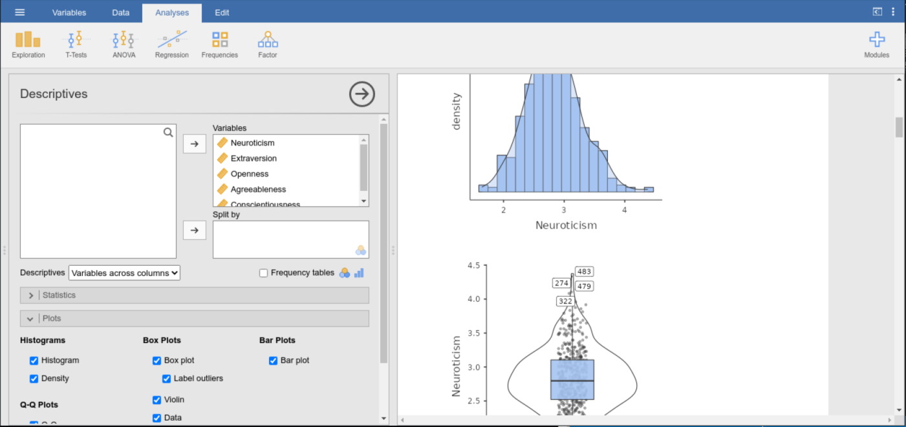

# **Jamovi**: open statistical software for the desktop and **cloud**

Home page: [https://www.jamovi.org/](https://www.jamovi.org/)  
Git Hub: [https://github.com/jamovi/jamovi](https://github.com/jamovi/jamovi)

Installing the software on personal computer is somewhat easy if you have administrative rights. Under Linux, the desktop version is distributed via [Flatpak](https://flathub.org/apps/details/org.jamovi.jamovi) which could be installed with user privileges but the installation does not work over X11, which make it difficult to run remotely on HPC clusters.

Fortunately, the cloud version is trivial to run :smile:

In the `docker-compose.yml` file one can see that there is an image to pull from [DockerHub](https://hub.docker.com/r/jamovi/jamovi/tags), so it is worth trying...

```bash
$ singularity pull docker://jamovi/jamovi

INFO:    Converting OCI blobs to SIF format
INFO:    Starting build...
Getting image source signatures
Copying blob da1fba9c174f done  
Copying blob ea796d88cf55 done  
Copying blob 405f018f9d1d done  
Copying blob bb3005988207 done  
Copying blob bcb7d4a7ae25 done  
Copying blob 811da9df0632 done  
Copying blob 3bc145650b26 done  
Copying blob 9fe387fb1211 done  
Copying blob 15ea899e936d done  
Copying blob 80402b684ebc done  
Copying blob 159b7fdf9cac done  
Copying blob b11c49873825 done  
Copying config dc747a34bd done  
Writing manifest to image destination
Storing signatures
2023/02/03 11:46:53  info unpack layer: sha256:405f018f9d1d0f351c196b841a7c7f226fb8ea448acd6339a9ed8741600275a2
2023/02/03 11:46:54  info unpack layer: sha256:ea796d88cf556b1104118dc27d524d8bd8dce5886f4f4b1b4dc7452ecdcc3b73
2023/02/03 11:46:54  info unpack layer: sha256:811da9df0632cdb24c1814f2179fb3e0a9635b059f9631ae4f25b91626509c28
2023/02/03 11:46:54  info unpack layer: sha256:bcb7d4a7ae25cdd8636c05d7919f2d58aec82dba4d39b0f61ce1e7365a3d05ea
2023/02/03 11:46:55  info unpack layer: sha256:bb30059882075224c48f7bc3ec67899decd88fe94c4211fdbe39b7208ee6bc63
2023/02/03 11:46:56  info unpack layer: sha256:da1fba9c174fe439a322fe215815c0c910b68133c3f9ae5e5f60410f8588c35a
2023/02/03 11:46:59  info unpack layer: sha256:3bc145650b262ff45b2853646ab46230d45c0ac2a5202eda32f5bcde3aba694a
2023/02/03 11:46:59  info unpack layer: sha256:9fe387fb1211e4512309c4bd4f002d0061a880d00ce1bc176940c29755abebf7
2023/02/03 11:47:00  info unpack layer: sha256:15ea899e936dab6bbbb4473e4e6ba5e270251bb5e4dee9c53786acb65ec8ba5e
2023/02/03 11:47:00  info unpack layer: sha256:80402b684ebcc0299fbeb5d43033a39713d5b8136f28a3b99b2c0526d9084bf0
2023/02/03 11:47:00  info unpack layer: sha256:159b7fdf9cac9720b3aeae8b55ed23d7efc308b642b3ba0b9ffa696cba882e5e
2023/02/03 11:47:00  info unpack layer: sha256:b11c49873825643bedfd1cad8bf88f4c4003695c8ec9ed3fc47200ce60567df2
INFO:    Creating SIF file...
```

Let's try to run it.

```bash
$ ./jamovi_latest.sif 
/usr/lib/jamovi/server/jamovi/server/__main__.py:116: DeprecationWarning: There is no current event loop
  loop = get_event_loop()
jamovi
version: 0.0.0
cli:     0.0.0
jamovi.server.server - listening across origin(s): 127.0.0.1:44431 127.0.0.1:39599 127.0.0.1:34611
jamovi.server.server - jamovi accessible from: 127.0.0.1:44431/?access_key=4fee88c51c854faa9d1b5d2486e6791a
ports: 44431, 39599, 34611, access_key: 4fee88c51c854faa9d1b5d2486e6791a

```
And open it in a browser...



Rather good results for the efforts...

If you want to build the very latest version, you need to build the [docker image](https://github.com/jamovi/jamovi/blob/current-dev/docker/jamovi-Dockerfile) yourself and then build the Singularity container from your local source - [look here for details](../docker2singularity.md).

