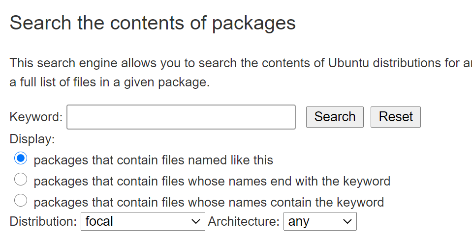
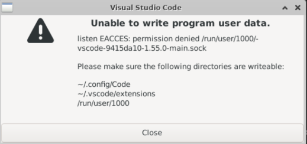

# Run Visual Studio Code with Singularity

<https://code.visualstudio.com/>

This is another real-life scenario. VSCode got rather popular these days, but it is still not available to run on Rackham...

Let's try to assemble a recipe and see what difficulties could bring this.

For Debian distributions the installation is done via downloading a package .deb file.  
`https://code.visualstudio.com/sha/download?build=stable&os=linux-deb-x64`

## 1. The common...

If we choose the "static" builds path i.e. not using `--sandbox`, then we can come up with something like this right away.

``` singularity linenums="1"
BootStrap: docker
From: ubuntu:20.04

%post
  export DEBIAN_FRONTEND=noninteractive
  apt-get -y update
  apt-get -y install wget git curl

  cd /
  wget "https://code.visualstudio.com/sha/download?build=stable&os=linux-deb-x64" -O code_stable_amd64.deb
  apt-get -y install ./code_stable_amd64.deb

  apt-get clean

%environment
  export LC_ALL=C

%runscript
  /bin/bash
```

- **lines 1-6**: something trivial. We use docker and Ubuntu.20.04, set `export DEBIAN_FRONTEND=noninteractive` and update the `apt` repositories.
- **line 7**: make sure we have some tools since VSCode might need them and they are not that big anyway.
- **lines 9-11**: downloads the latest stable release and we save it as `code_stable_amd64.deb`. What happens if you do not specify the name of the output file. Try it in the terminal.
- **line 13**: just the usual cleaning.
- **lines 15-16**: Some safe defaults
- **lines 18-19**: At this point we do not know where the executable will be, so we will start just a bash shell instead.

Build the recipe, and run it. This will start a shell in the container. Use `which code` to find the location of the VSCode program.
``` bash
$ sudo singularity build vscode.sif Singularity.vscode
```
``` bash
$ ./vscode.sif
Singularity $ which code
```
While in the container, try to start the editor with `code`.

Most probably you will get an error about a missing dynamic library `libX11-xcb.so.1` (_version 1.55.0-1617120720_) . Seems that this was not in the dependency of the package...

## Finding the missing pieces
This is an easy case - it could be more problematic. Visit https://packages.ubuntu.com/ and use the "Search the contents of packages" for `focal` (Ubuntu 20.04) to find which package could possibly provide the missing library.


You should be able to find that `libx11-xcb1` package contains this file... So, we need to add it to the `apt-get install ...` line and rebuild. In the general case there might be more missing libraries and using tools like `ldd` might come more handy to track down multiple missing libraries.

## Add the corrections and rebuild
- add `libx11-xcb1` to line 7
- replace line 19 with the full path to the program to start `/usr/bin/code $@`

??? note "code"
    ``` singularity linenums="1"
    BootStrap: docker
    From: ubuntu:20.04

    %post
      export DEBIAN_FRONTEND=noninteractive
      apt-get -y update
      apt-get -y install wget git curl vim  libx11-xcb1

      cd /
      wget "https://code.visualstudio.com/sha/download?build=stable&os=linux-deb-x64" -O code_stable_amd64.deb
      apt-get -y install ./code_stable_amd64.deb
  
      apt-get clean
      rm code_stable_amd64.deb

    %environment
      export LC_ALL=C

    %runscript
      /usr/bin/code $@
    ```

## Run again

Unfortunatelly we are not ready. There will be this pop up window with warnings...



There might be better ways to do this but at this point we will just give write access to `/var` to our container.

``` bash
$ singularity run -B /run ./vscode.sif 
```
Note that we did not specify the destination of the folder in the container, but the syntax allows it and this will be equivalent to `-B /run:/run`
