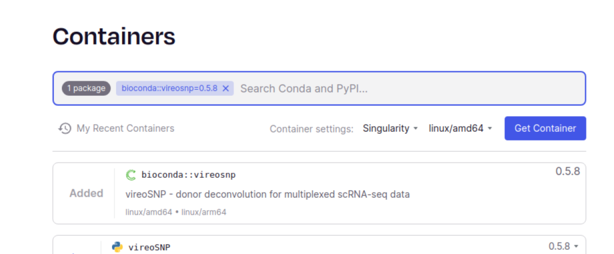

# Seqera containers - brief walk-through

Web page [https://seqera.io/containers/](https://seqera.io/containers/)

## Using the web interface


Select the packages you need, select "Singularity" and "linux/amd64" in the container settings, and push the button to start the building process or get the link for an already available container.

!!! info
    Container images are built on-demand by using Seqera’s publicly hosted [Wave](https://seqera.io/wave/) service. When you request an image, the following steps take place:

    1. The set of packages and their versions are sent to the Seqera Containers API, including configuration settings such as image format (Docker / Singularity) and architecture (amd64 / arm64).
    2. The Seqera Containers API validates the request and calls the Wave service API to request the image.
    3. The Wave service API returns details such as the image name and build details to the Seqera Containers backend, which are then returned to the web interface.
    4. The web interface uses the build ID to query the Wave service API directly for details such as build status and build details.
    5. If needed, Wave creates the container build file (either `Dockerfile` or Singularity recipe) and runs the build. It returns the resulting image and pushes it to the Wave community registry for any subsequent request.


## Command line `wave-cli`

Command line tools [GitHub](https://github.com/seqeralabs/wave-cli)

!!! Info
    Features  
    - Build container images on-demand for a given container file (aka Dockerfile);  
    - Build container images on-demand based on one or more Conda packages;  
    - Build container images for a specified target platform (currently linux/amd64 and linux/arm64);  
    - Push and cache built containers to a user-provided container repository;  
    - Push Singularity native container images to OCI-compliant registries;  
    - Mirror (ie. copy) container images on-demand to a given registry;  
    - Scan container images on-demand for security vulnerabilities;

### Example 
- Build and wait til it is done.
```bash
$ wave -s --freeze --conda-package conda-forge::ase --conda-package conda-forge::xorg-libx11 --await
oras://community.wave.seqera.io/library/ase_xorg-libx11:4f81a2d24b8b708d
```
- Run the tool to test.
```bash
$  singularity exec oras://community.wave.seqera.io/library/ase_xorg-libx11:4f81a2d24b8b708d ase info 
INFO:    Downloading oras image
255.0MiB / 255.0MiB [=========================================================================================] 100 % 61.3 MiB/s 0s

platform                 Linux-6.8.0-45-generic-x86_64-with-glibc2.37
python-3.13.0            /opt/conda/bin/python3.13
ase-3.23.0               /opt/conda/lib/python3.13/site-packages/ase
numpy-2.1.2              /opt/conda/lib/python3.13/site-packages/numpy
scipy-1.14.1             /opt/conda/lib/python3.13/site-packages/scipy
matplotlib-3.9.2         /opt/conda/lib/python3.13/site-packages/matplotlib
spglib                   not installed
ase_ext                  not installed
flask-3.0.3              /opt/conda/lib/python3.13/site-packages/flask
psycopg2                 not installed
pyamg                    not installed
```
- Run the GUI of the tool.
```bash 
$ singularity exec oras://community.wave.seqera.io/library/ase_xorg-libx11:4f81a2d24b8b708d ase gui
INFO:    Using cached SIF image
```


